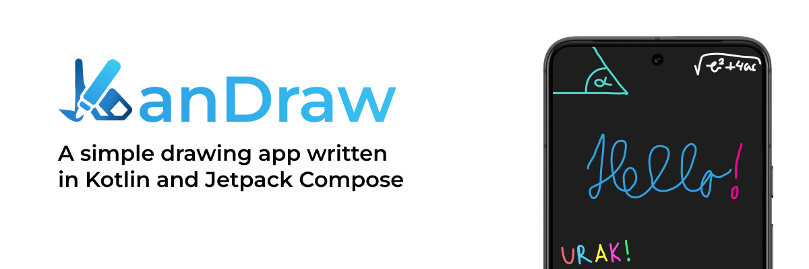
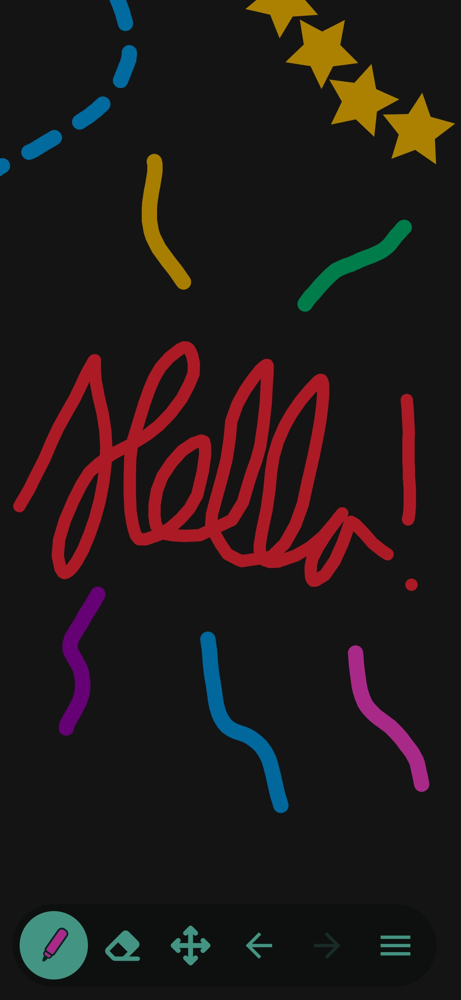
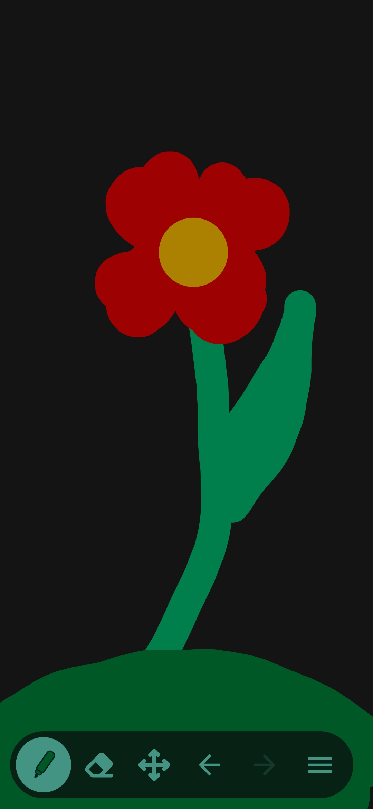
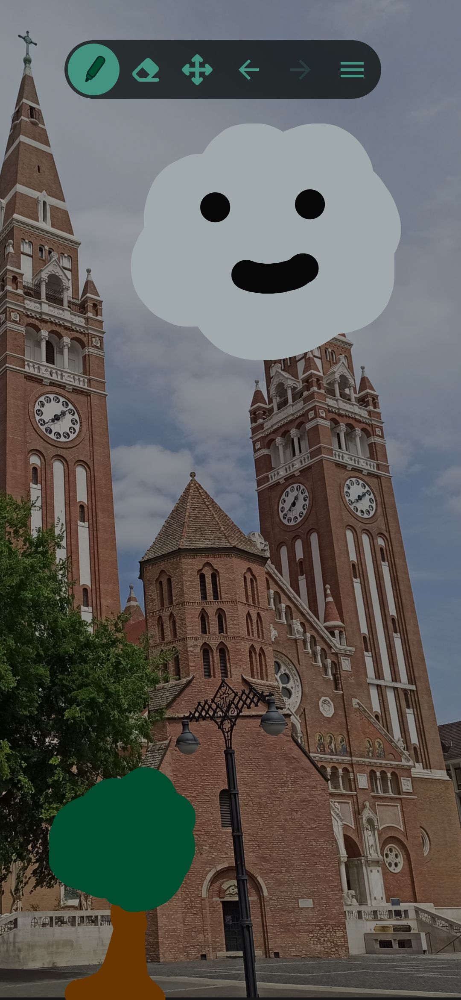
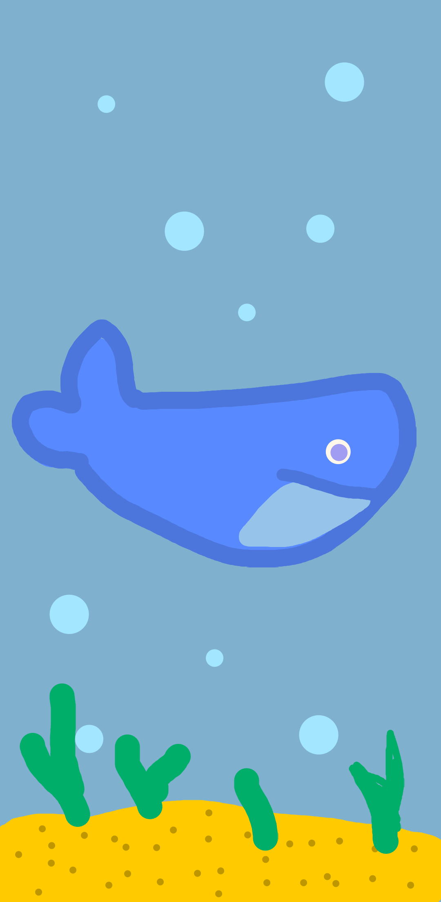

# KanDraw
KanDraw is a simple drawing app for android created with Kotlin and Jetpack Compose for my physics teacher.

# System requirements
- Android 9 or up
- 20,00 MB of storage

# Features
- Drawing
  - Select any color using HSV color picker or from defualts
  - Select pen settings (width, cap, alpha etc.)
  - Select and customize pen effects (stripped, custom shapes, etc.)
- Erasing
  - Select eraser width
- Import image
- Save drawing
  - The app can create its own album or just save it to pictures.
  - Support for exporting with a transparent background
- Select custom color
- Undo
- Redo
- Fully customizable grid
- Clear canvas
- Color picker
  - Pick colors from your drawing or from an imported image
- Infinite canvas
  - Draw anywhere on the canvas, giving you endless space to create. 
- Large screen support

# Demo

  
  
  

- Saved drawing

  

# Thanks to
[Skydoves](https://github.com/skydoves) for the beautiful [color picker](https://github.com/skydoves/colorpicker-compose) used in KanDraw
[PatilShreyas](https://github.com/PatilShreyas) for the [Capturable](https://github.com/PatilShreyas/Capturable) utility used to save drawings